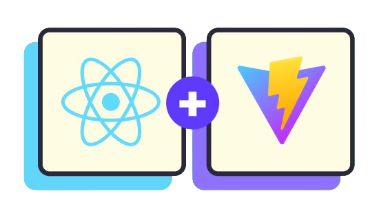

English | [Spanish](./README.esp.md)

# Welcome to my portfolio's repository!

If you are here it means that you're interested in what I can do, so you're welcome! Checkout more about myself on my web page!

[charlymech.com](https://charlymech.com/)

### What did I use for this portfolio?

I'm a backend and mobile developer so web-dev is not my strongest tech skill, however I decided to make this portfolio renewal with some cool tools that I found online.

The main tools I used for this project is React+Vite so I can create my custom components using the Material UI style.

If you liked my work you can contact me via [LinkedIn](https://www.linkedin.com/in/carlos-sanchez-recio-77a286243/)
